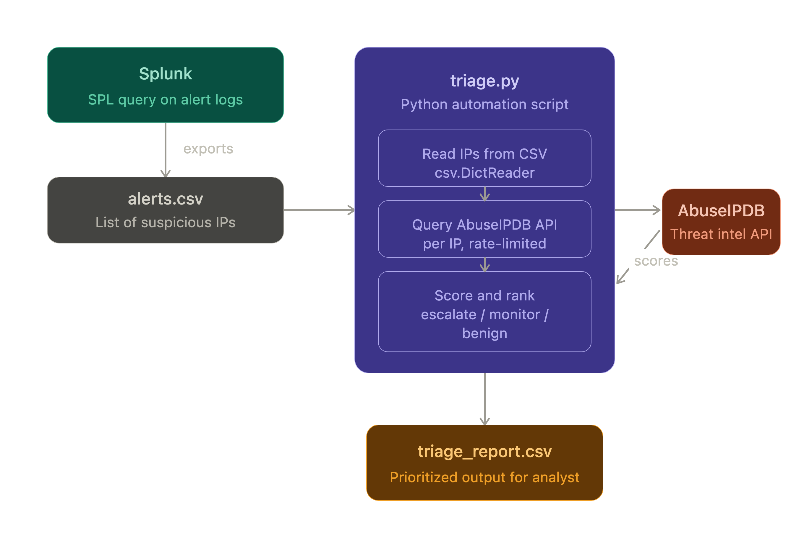

# IOC Triage Automation

Automates the first step of SOC alert triage: take a list of suspicious IP addresses
(exported from a SIEM like Splunk), check each one against the AbuseIPDB threat
intelligence API, and produce a prioritized report so an analyst can immediately see
which IPs need escalation and which are likely benign.

## Why I built this

SOC analysts spend a large share of triage time on repetitive IP reputation lookups.
This tool removes that manual step: what used to be dozens of browser tabs becomes a
single command that returns a ranked report. It demonstrates how automation reduces
mean-time-to-respond (MTTR) and lets analysts spend their time on actual
investigation instead of copy-paste lookups.

## Architecture



1. **Splunk** — An SPL query flags suspicious source IPs (e.g., high failed-login
   counts) and exports them to `alerts.csv`.
2. **`triage.py`** — Reads the CSV, deduplicates IPs, queries the AbuseIPDB API for
   each one (rate-limited to respect API quotas), and scores them.
3. **`triage_report.csv`** — Ranked output with a per-IP recommendation:
   `HIGH PRIORITY - escalate`, `MONITOR`, `LIKELY BENIGN`, or `ERROR - check manually`.

## Features

- **Threat intel enrichment** — Pulls abuse confidence score (0–100), country, ISP,
  usage type, and total report count per IP from AbuseIPDB.
- **Risk-based recommendations** — Configurable score threshold (default 50) maps
  each IP to escalate / monitor / likely-benign tiers.
- **Deduplication** — Repeated IPs in the input are checked only once.
- **Rate-limit aware** — Configurable delay between API calls; HTTP 429 responses are
  caught and surfaced per-IP instead of crashing the run.
- **Resilient error handling** — Failed lookups are recorded in the report with an
  `ERROR - check manually` recommendation rather than aborting the batch.
- **Ranked output** — Report is sorted by abuse score, highest risk first.

## Setup

1. Get a free AbuseIPDB API key at https://www.abuseipdb.com/account/api
2. Create a `.env` file in the project root (already git-ignored):
   ```
   ABUSEIPDB_API_KEY=your_api_key_here
   ```
3. Install dependencies:
   ```
   pip install requests python-dotenv
   ```
4. Run:
   ```
   python triage.py -i alerts.csv -o triage_report.csv
   ```

## Usage

```
python triage.py [-i INPUT] [-o OUTPUT] [-t THRESHOLD] [-d DELAY]

  -i, --input       Input CSV with an `ip` column (default: alerts.csv)
  -o, --output      Output report path (default: triage_report.csv)
  -t, --threshold   Abuse score (0-100) at or above which an IP is
                    flagged HIGH PRIORITY (default: 50)
  -d, --delay       Seconds to wait between API calls (default: 1.2)
```

Example — stricter threshold for a noisy alert queue:

```
python triage.py -i alerts.csv -o report.csv -t 75 -d 2.0
```

## Example SPL query used to generate input

```
index=botsv1 sourcetype=stream:http
| stats count by src_ip
| where count > 10
| rename src_ip as ip
| table ip
```

## Sample output

`triage_report.csv`:

| ip | abuse_score | country | isp | usage_type | total_reports | recommendation | error |
|----|----|----|----|----|----|----|----|
| 185.220.101.1 | 100 | DE | Artikel10 e.V. | Data Center/Web Hosting/Transit | 151 | HIGH PRIORITY - escalate |  |
| 8.8.8.8 | 0 | US | Google LLC | Search Engine Spider | 128 | LIKELY BENIGN |  |

## Project structure

```
├── triage.py                   # Main triage script (CLI via argparse)
├── alerts.csv                  # Sample input: suspicious IPs exported from Splunk
├── triage_report.csv           # Sample ranked output report
├── ioc_triage_architecture.png # Architecture diagram
├── .env                        # AbuseIPDB API key (git-ignored, you create this)
└── .gitignore
```

## Possible future improvements

- Corroborate scores with a second intel source (e.g., VirusTotal) before escalating
- Auto-create tickets in TheHive for high-priority findings
- Push HIGH PRIORITY findings to a Slack/email webhook for real-time alerting
- Batch API requests to reduce round trips on large alert volumes
